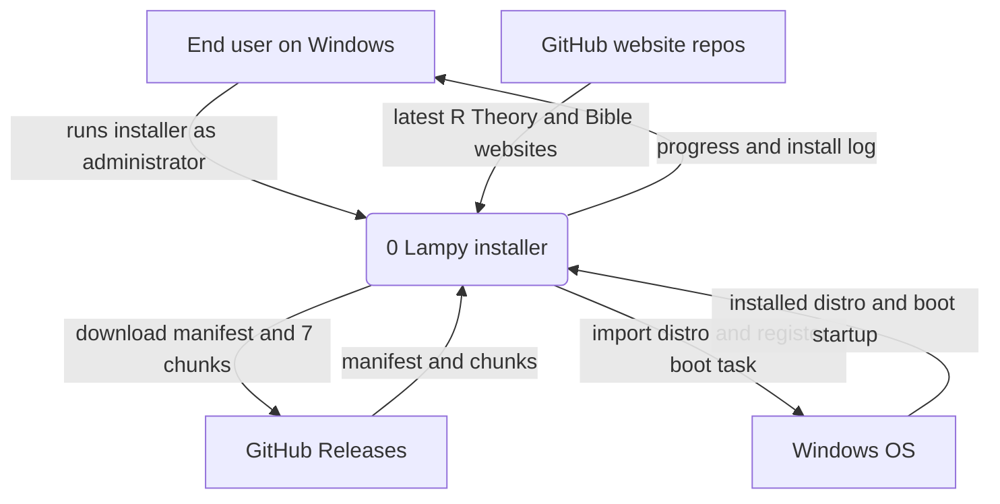
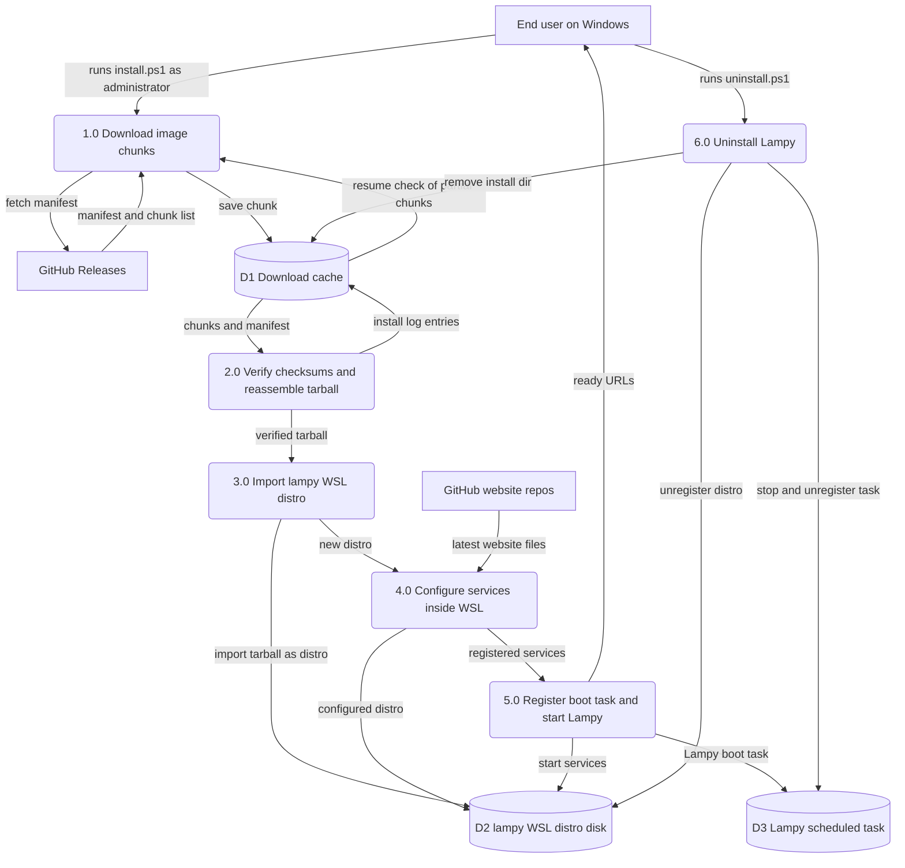
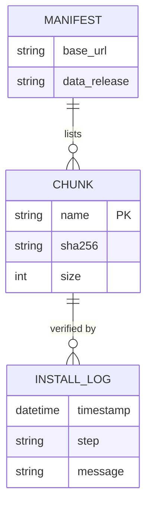

Living document — update these diagrams when adding features.
# lampy-installer — Architecture

Windows installer for the Lampy WSL stack. The repo holds the PowerShell install/uninstall scripts, NSIS wrapper definitions, the chunk manifest, and build-time helpers. It has no runtime application of its own: install.ps1 is the product, and it performs a one-shot install of the Lampy system image as a WSL2 distro, then configures it and registers a Windows boot task.

## 1. Context diagram (level 0)

## 2. Level-1 data flow diagram

## 3. Entity–relationship diagram

The repo has no persistent application data model and no database. All state lives as files on the Windows machine: the download cache, the WSL virtual disk, and the scheduled task. The only structured data definition in the repo is the chunk manifest, which is a download descriptor rather than a managed data model.

## Grounding notes

- Observed: README.md describes install.ps1 doing five numbered steps — download the 11 GB image in 7 chunks from GitHub Releases, enable WSL2, import the lampy distro, fetch the latest R Theory and Bible websites from GitHub, start all 8 services, register boot startup; plus C:\Lampy layout, the port list, password-change steps, and the -TarballPath flag for a local tarball.
- Observed: install.ps1 is 526 lines with Write-Step lines matching those phases; uninstall.ps1 stops and unregisters the Lampy scheduled task, runs wsl --unregister lampy, and deletes C:\Lampy; manifest.json lists base_url plus 7 named chunks each with sha256 and size and the tarball sha256; lampy-slim.nsi wraps the scripts into Lampy-Setup.exe with %LOCALAPPDATA%\Lampy\download as the permanent download folder and states NSIS never downloads — install.ps1 owns chunk inventory, resumable download, verification, and reassembly; verify-bundle.py asserts the NSIS File list matches the files the scripts reference.
- Observed: the repo has no schema, migration, model file, or config table — only scripts, manifests, and NSIS definitions.
- INFERRED: the flow labels "resume check of partial chunks" and "ready URLs" summarize behavior described in the README and NSIS comments but are not literal names from the repo.
- INFERRED: relationship to lampy-admin — lampy-admin runs inside the distro this installer creates (its README says it deploys as supervisord program "console" inside the lampy distro), but nothing in this repo names or bundles the console, so whether it is baked into the pre-built system image or added later is not observable here.

## Relationship to the other repo

lampy-installer creates the WSL distro that lampy-admin runs inside of. The installer delivers the full Lampy stack including the forum app the console reads and writes. The lampy-admin repo contains Refresh-WslPortForwards.ps1, a Windows-side script that complements the installer's port setup by refreshing WSL port forwards. The console updates itself from the lampy-admin GitHub releases, independent of any installer release.
