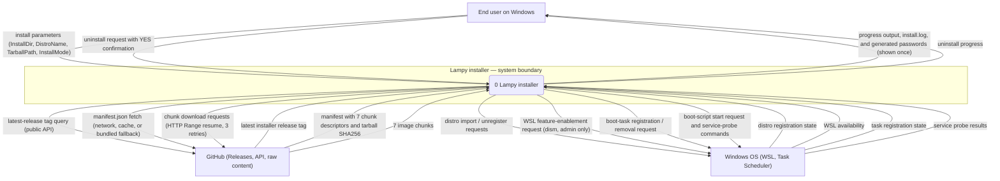
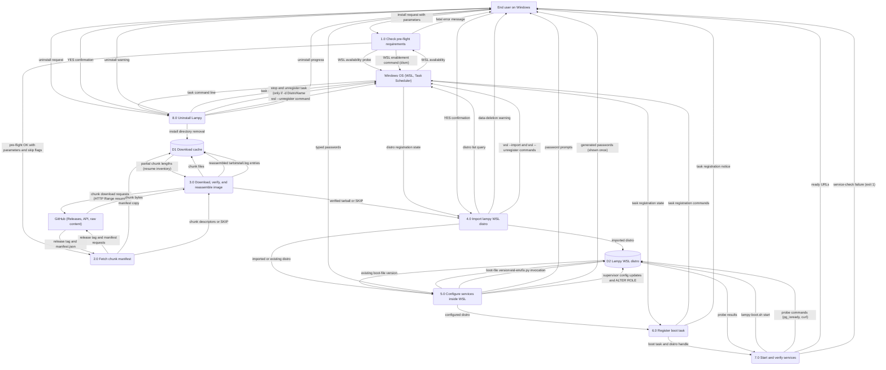
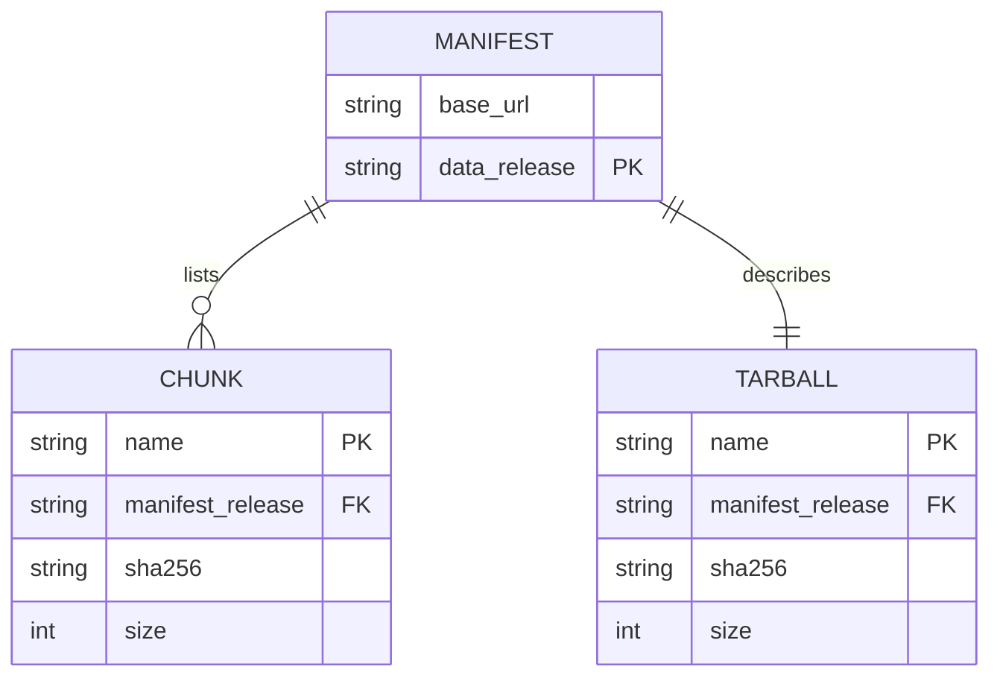

Living document — update these diagrams when adding features.
# lampy-installer — Architecture

Windows installer for the Lampy WSL stack. The repo holds the PowerShell install/uninstall scripts, the NSIS wrapper definitions, the chunk manifest, and build-time helpers. It has no runtime application of its own: `install.ps1` is the product, and it performs a one-shot install of the Lampy system image as a WSL2 distro named `lampy`, then configures it and registers a Windows boot task.

The install is **per-user**: no elevation is required. Elevation matters only for the one-time WSL feature enablement (if WSL is missing, the script throws and tells the user to re-run once as administrator, enable WSL, reboot, and re-run normally). When run elevated, the boot task is registered at-startup as SYSTEM (previous behavior); the normal per-user path registers an at-logon task as the installing user. WSL distros are per-user (registered under HKCU), so an elevated SYSTEM task would not see the user's distro.

## 1. Context diagram (level 0)

## 2. Level-1 data flow diagram

## 3. Entity–relationship diagram

No persistent application data model was observed: the repo has no schema, migration, model file, or config table — only scripts, manifests, and NSIS definitions. The only structured data definition in the repo is the chunk manifest, a download descriptor. This ERD describes that file's structure, not a managed data model. Runtime state (the WSL virtual disk, the scheduled task) lives in Windows/WSL, outside the repo.

## Grounding notes

- OBSERVED (install.ps1, repo main HEAD `237e12d` v1.1.10): runs per-user with no elevation (line 11: "Runs per-user (no elevation needed)"); elevation is only for the one-time WSL feature enablement. Pre-flight fails fast on OS floor (Windows 11 = Major 10 build 22000+, floor not exact match) and on missing virtualization (VT-x/AMD-V or hypervisor); if WSL is missing and the user is not admin it throws asking for one admin re-run, else it enables WSL via dism and exits 2 (reboot, re-run).
- OBSERVED (install.ps1): repair mode (`-InstallMode repair`) with the distro already registered sets `$tarball = "SKIP"` and skips the image download entirely (Kit-verified test G009); fresh mode (`G007`) starts the download; import skips when the distro is registered in repair mode, and a fresh install over an existing distro asks `YES (all caps)` before `wsl --unregister` — it never silently destroys a distro (the v1.1.2 wipe is named in a comment as the bug this guards).
- OBSERVED (install.ps1): manifest discovery tries, in order, the public GitHub releases API for the latest tag, `raw.githubusercontent.com/<tag>/manifest.json`, the cached `<DownloadDir>/manifest.json`, then the `-FallbackManifest` bundle; aborts when all fail.
- OBSERVED (install.ps1): chunk download uses `System.Net.HttpWebRequest` with `AddRange` resume (deliberately not HttpClient — v1.1.1 comment: some machines cannot load that assembly), 3 attempts per chunk, 10 s between retries, progress every 15 s; a legacy `C:\Lampy\download` one-time migration shim moves matching chunks to the new download dir.
- OBSERVED (install.ps1): verification checks every chunk's byte size, then SHA256; a bad chunk is deleted and re-downloaded once, and a second failure aborts ("Good chunks are NEVER deleted"); the tarball is reassembled by concatenating chunks in manifest order and re-validated by size and SHA256 before use.
- OBSERVED (install.ps1): step 3 runs `wsl-envfix.py` (piped to `python3` inside the distro) only when the distro's `LAMPY_BOOT_VERSION` is below the script's `BOOT_VERSION`; passwords are collected with `Read-Host -AsSecureString` (postgres, forum, code-server; empty = generate random unambiguous or disable code-server), applied via `set-passwords.py` over stdin as base64 JSON (never logged or on a command line), and synced to PostgreSQL roles with `ALTER ROLE` via stdin psql; generated passwords are printed once.
- OBSERVED (install.ps1): step 4 registers the scheduled task `Lampy` running `wsl.exe -d <DistroName> -u root /usr/local/bin/lampy-boot.sh keepalive`, with `-Force` on re-register (fix for step-4 re-run failure); elevated runs register at-startup as SYSTEM, per-user runs register at-logon as the installing user.
- OBSERVED (install.ps1): step 5 shuts down any old supervisord, runs `lampy-boot.sh`, waits 60 s, then probes PostgreSQL (`pg_isready`), Apache `/`, forum `/app/`, Ollama `/api/tags`, and code-server `/` (only when enabled) — each up to 3 attempts 15 s apart, verified **from inside WSL** (comment: Windows→WSL localhost forwarding is unreliable, verified broken on Toetop 2026-09-28 — never `Invoke-WebRequest http://localhost/` from Windows); exits 1 when any check fails; prints the ready URLs.
- OBSERVED (uninstall.ps1): per-user, asks `YES (all caps)` before deleting; removes the scheduled task only when its action's command line matches `-d <DistroName>` (the v1.1.10 task-safety fix — a task for a different distro is left alone; Kit-verified test G011); then `wsl --unregister`, then removes the install dir.
- OBSERVED (manifest.json): `base_url` `https://github.com/cosbykit-afk/lampy-installer/releases/download/v1.0.0`, `data_release` `v1.0.0`, 7 chunks `lampy-public.tar.part-aa`..`part-ag` (each with `name`, `sha256`, `size`; six are 1,887,436,800 bytes, the last 228,433,920), and `tarball` `{name: lampy-public.tar, sha256: f6f71015…, size: 11553054720}` (11,553,054,720 bytes ≈ 11.6 GB decimal / 10.8 GiB). `lampy-public.tar.full.sha256` carries the same tarball hash.
- OBSERVED (lampy-slim.nsi): the current wrapper — `PRODUCT_VERSION "1.1.10"`, `RequestExecutionLevel user`, `InstallDir $LOCALAPPDATA\Lampy`, permanent `DOWNLOAD_DIR $LOCALAPPDATA\Lampy\download`; bundles exactly `install.ps1`, `uninstall.ps1`, `manifest.json`, `wsl-envfix.py`, `set-passwords.py`; detects an existing virtual disk and offers Yes=Reinstall / No=Repair / Cancel; runs install.ps1 via `nsExec::ExecToLog` with `-InstallMode`; writes per-user Start Menu shortcuts and an HKCU uninstall registry entry. The older `lampy.nsi` (PRODUCT_VERSION 1.0.0, `RequestExecutionLevel admin`, 30 GB single-file payload) is superseded.
- OBSERVED (verify-bundle.py): build-time guard that parses install.ps1/uninstall.ps1 for every `Join-Path $PSScriptRoot "<name>"` reference and asserts each file is in the staging dir and the NSIS `File` list — the check that would have caught v1.1.1 shipping without `wsl-envfix.py`.
- OBSERVED (set-passwords.py): reads JSON from the `__CONFIG_B64__` placeholder (base64, filled by install.ps1 before piping over stdin); writes each password as exactly one `environment=` line in its supervisor program section.
- OBSERVED (wsl-envfix.py): `BOOT_VERSION = 2`; idempotent WSL adaptations (postgres PATH/PGDATA, supervisor RPC sections, boot script); password-related environment is owned by set-passwords.py, not this script.
- INFERRED: the DFD groups the scripts' linear numbered phases into 8 processes; the grouping is my synthesis. Install parameters (`InstallDir`, `DistroName`, `TarballPath`, `ReleaseTag`, `DownloadDir`, `InstallMode`, `FallbackManifest`) are the process inputs.
- INFERRED: the "End user on Windows" runs the NSIS `Lampy-Setup.exe` GUI or the raw scripts; the NSIS choice dialog maps to `-InstallMode fresh|repair|reinstall`.
- OBSERVED (local git log at 237e12d; GitHub API): v1.1.4 (NSIS window output via nsExec, service-check retries), v1.1.5 (supervisord daemon mode, idempotent boot script), v1.1.6 (quoted-password detector — repair prompts on Toetop), v1.1.7 (NSIS window output, retries), v1.1.8 (boot-file version check in repair), v1.1.9 (remove redundant mkdir), `-Force` on `Register-ScheduledTask` (step-4 re-run fix), and v1.1.10 (`237e12d`): repair skips download, uninstall task-safety. The local commits 3cedb56–237e12d (v1.1.4–v1.1.10) are absent from GitHub main; note GitHub main (`2845fb5d`) is a divergent branch that carries its own v1.1.5/v1.1.6/v1.1.9-labeled commits, so the two mains will not fast-forward. Resolving the code divergence (merge vs force-push) is Kit's decision; this doc describes the local v1.1.10 code.

## Relationship to the other repo

lampy-installer creates the WSL distro that lampy-admin runs inside of. The installer delivers the full Lampy stack including the forum app whose database the console reads and writes. The lampy-admin repo contains `Refresh-WslPortForwards.ps1`, a Windows-side script that complements the installer's port setup by refreshing WSL port forwards; the console's windowstools tab serves that same file and refreshes those forwards over SSH. The console updates itself from the lampy-admin GitHub releases, independent of any installer release.
